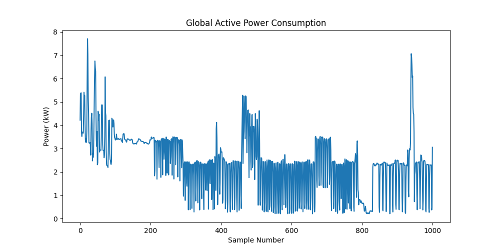
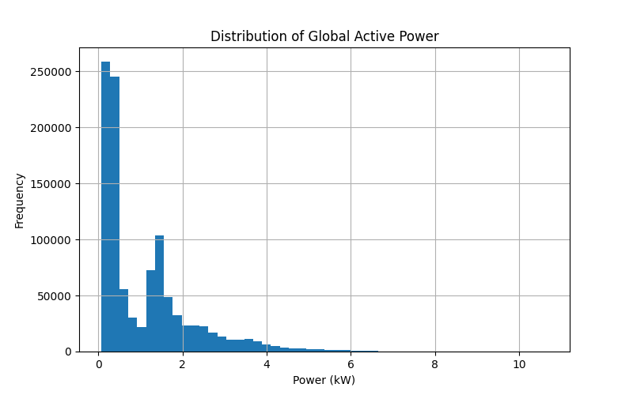

# Household Energy Consumption Analysis

## Project Overview
This project analyzes household electricity consumption data using Python. The objective is to explore energy usage patterns, identify missing values, clean the dataset, and visualize power consumption trends.

## Dataset
- Dataset: Household Power Consumption
- Records: 1,048,575
- Features: 9

## Tools Used
- Python
- Pandas
- Matplotlib
- NumPy

## Analysis Performed
1. Data loading and inspection
2. Missing value analysis
3. Data cleaning
4. Power consumption visualization
5. Distribution analysis

## Results
- Identified 4,069 missing values in Sub_metering_3
- Cleaned dataset size: 1,044,506 records
- Generated power consumption and distribution graphs

## Future Improvements
- Time-series analysis
- Daily and monthly energy trends
- Energy consumption forecasting
- Machine learning models for prediction

## Visualizations

### Power Consumption Trend

### Power Distribution

